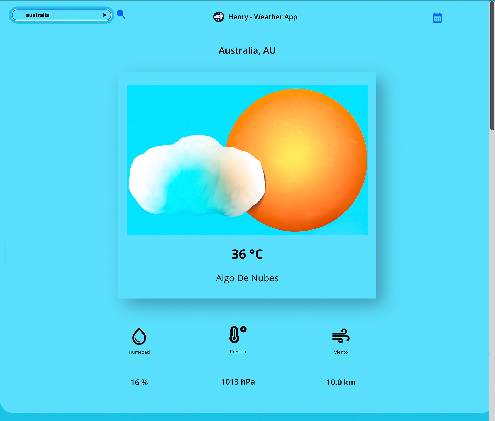

<h1 align="center">Weather App</h1>



Una aplicación de clima en tiempo real construida con **React 18**. Utiliza la API de [OpenWeatherMap](https://openweathermap.org/) para mostrar la información del clima de diferentes ciudades.

## Características
- Consulta el clima de cualquier ciudad.
- Muestra temperatura, humedad, viento y más.
- Uso de modelos 3D creados con la herramienta [Spline](https://spline.design/).
- Responsiva, adaptada para dispositivos móviles.

## Requisitos

- **Node.js** y **npm** instalados.

## Instalación

1. Clona el repositorio:
   ```bash
   git clone https://github.com/tu-usuario/nombre-del-repositorio.git

2. Instala las dependencias:
   ```bash
   npm install

## Ejecución

- Para iniciar la aplicación:

   ```bash
   npm start

Accede a la app en http://localhost:3000
